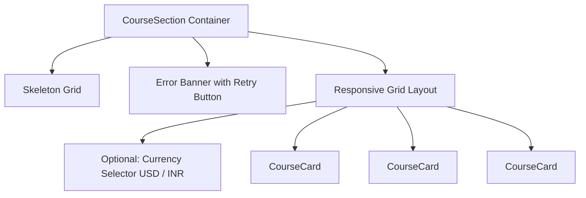

# Chat Conversation

Note: _This is purely the output of the chat conversation and does not contain any raw data, codebase snippets, etc. used to generate the output._

### User Input

I’m building the Skillpath landing page for a Framer junior developer assignment. I want to implement the main courses section as a React Code Component rather than using Framer Fetch.

Before writing code, help me think through the implementation.

The API has two GET endpoints:

* `/assignment/course-data` — returns a variable-length array of 5–10 courses
* `/assignment/country-code` — returns either `IN` or `US`

The API intentionally fails around 1 in 3 requests with 404/500 responses.

The course cards need to show the course name, a 2-line description, localized price, and one useful additional field. INR comes from `pricePaise / 100` and USD comes from `priceUsdCents / 100`.

The important part is handling the two API calls independently. If courses load but the country request fails, I don't want to throw away the courses. I need a sensible UX for that situation.
this is the response i would get structure 
{
  "courseName": "How To YouTube",
  "courseCode": "how-to-youtube",
  "description": "From concept to creation, learn how to build, grow, and monetize a YouTube channel using practical systems and real-world execution.",
  "mainCategory": "Content Creation",
  "shortCourse": "YouTube",
  "courseType": "Original",
  "pricePaise": 199900,
  "priceUsdCents": 3999,
  "mangoId": "a1b2c3d4e5f6789012345678",
  "refundable": true
}
2. /assignment/country-code
Returns {"country_code": "IN"} or {"country_code": "US"}. It flips between the two.


The component also needs loading, error, empty states, responsive 3/2/1 column layout, and two Framer property controls.

I want the implementation to stay simple and readable because I'll need to explain the code in an interview.

First, don't write the full component. Review this approach, point out any edge cases I'm missing, and suggest a simple component/state structure.


### Planner Response

I will list the files in the workspace directory to see if there is any existing code, boilerplate, or mockup setup we should align with.

*Listed directory [assignment](file:///Users/raheel/Developer/assignment) *

### Planner Response

Here is a review of your approach, including the key edge cases to look out for, a suggested UX solution for independent failures, and a clean component/state structure optimized for readability and interview discussions.

---

### 1. Key Edge Cases & UX Enhancements

#### Independent API Failure (The "Flaky API" UX)
* **The Strategy**: If `/assignment/course-data` succeeds but `/assignment/country-code` fails, the worst thing to do is hide the courses or show a generic error.
* **The Solution**: 
  * Default to a fallback currency (e.g., USD or a Framer Property Control value).
  * Display a subtle **"Location offline: showing default pricing (USD)"** notice or a clean **inline currency toggle** (USD / INR) on the UI. This lets the user know the system degraded gracefully and allows them to manual-correct if needed.
  * If the courses request fails, show a full-screen block error card with a **"Retry" button**. Since the API has a 1-in-3 failure rate, a manual retry is essential.

#### Race Conditions on Retry
* **The Issue**: If a user double-clicks "Retry" or if components remount quickly, multiple fetches can resolve out-of-order.
* **The Solution**: Use an `AbortController` inside a `useEffect` cleanup function or use an active flag (`let active = true`) to prevent setting state on unmounted components or outdated requests. This shows deep React lifecycle knowledge in an interview.

#### Formatting & Locale Specifics
* **The Issue**: Printing currency raw (e.g., `$39.99` or `Rs 1999`) looks unprofessional. 
* **The Solution**: Use JavaScript’s native `Intl.NumberFormat`. Note that the locales should match:
  * For USD: `new Intl.NumberFormat("en-US", { style: "currency", currency: "USD" })`
  * For INR: `new Intl.NumberFormat("en-IN", { style: "currency", currency: "INR" })` (handles Indian numbering format like `1,00,000` correctly).

#### Responsive Heights & Text Truncation
* **The Issue**: The 5–10 courses will have description texts of varying lengths. Mismatched description lengths cause the grid cards to look uneven.
* **The Solution**: Use CSS line-clamping (`-webkit-line-clamp: 2`) to enforce exactly two lines, and flex column layouts (`flex-grow: 1`) on the card body so all buttons align perfectly at the bottom.

---

### 2. Suggested Component & State Structure

To keep the implementation simple, readable, and easy to explain in an interview, separate concerns into **three distinct sections**:
1. **State Orchestration & Fetching** (Parent Container)
2. **Presentational Cards** (Child Component)
3. **Framer Property Controls** (Configuration)

Here is a clean file layout and state blueprint for [CourseSection.jsx](file:///Users/raheel/Developer/assignment/CourseSection.jsx):

#### State Blueprint
```jsx
// Main Component: CourseSection
export default function CourseSection(props) {
  // Framer Property Controls map directly to props
  const { fallbackCurrency = "US", accentColor = "#0070F3", showRefundable = true } = props;

  // 1. Courses State (Blocking: needs to succeed to show grid)
  const [courses, setCourses] = useState([]);
  const [loadingCourses, setLoadingCourses] = useState(true);
  const [coursesError, setCoursesError] = useState(null);

  // 2. Country/Currency State (Non-blocking: degrades gracefully)
  const [country, setCountry] = useState(null); // 'US' | 'IN' | null
  const [loadingCountry, setLoadingCountry] = useState(true);
  const [countryError, setCountryError] = useState(false);

  // 3. User-toggled currency (allows manual override if country fails)
  const [manualCurrency, setManualCurrency] = useState(null);

  // Fetch function...
}
```

#### Component Hierarchy



### 3. Recommended Framer Property Controls

Framer property controls are defined at the bottom of the file. To keep your component highly interactive and customizable for designers:
1. `fallbackCurrency`: A `ControlComponent` of type `EnumType` (Options: `["US", "IN"]`, Titles: `["USD ($)", "INR (₹)"]`). This configures what to display if the location check fails.
2. `accentColor`: A `ControlComponent` of type `ColorType` to let designers match the "Refundable" badge or buy button colors directly in the Framer canvas.

### 4. Summary of Work & Next Steps
We analyzed:
* How to fetch the endpoints in parallel while ensuring that `/assignment/country-code` rejections do not crash the course grid rendering.
* Edge cases such as API retries, race conditions, proper localization mapping, and grid alignment.
* A clean state footprint and hierarchy structure.

Would you like to write the complete React component file now, or do you have any questions on this layout?

### User Input

Suppose /course-data succeeds and gives me 8 courses, but /country-code returns a 500.

Would you keep the courses visible and show something like "Price unavailable", or would you retry/fallback to a default currency?

I don't want to silently assume INR or USD because that could show the wrong price. Explain what you think is the best product decision here and why.

### Planner Response

Here is a product design and UX analysis of how to handle this scenario, which is a fantastic talking point for a junior developer interview.

---

### The Recommended Product Decision: **Fallback to a default currency + transparent UI + manual currency toggle**

For a landing page, **showing "Price unavailable" is a critical conversion killer**. If a user wants to buy a course but can't see the price, they will likely leave the page. 

Instead of showing nothing or silently guessing, the best approach is to **combine transparency with user control**. Here is why and how to implement it:

#### 1. Why a silent fallback is bad (as you noted)
If you silently assume USD, a user in India might see `$39.99` and think, *"This is too expensive / not localized for me."* Conversely, a user in the US seeing `₹1,99,900` would be confused by the currency symbol and format.

#### 2. Why "Price unavailable" is bad
It halts the user journey. The "Buy Now" button becomes useless if the user doesn't know what they are committing to pay.

#### 3. The Balanced Solution: "Transparent Fallback with Toggle"
Since the course object contains **both** `priceUsdCents` and `pricePaise`, the UI is never truly blocked from displaying price data. 

If `/country-code` fails (500 status):
1. **Fallback** to a default currency (e.g., USD, or a Framer Property Control choice).
2. **Render a subtle banner or inline notice** at the top of the course section (or next to the price) saying:
   > 🌐 *We couldn't detect your location. Showing USD pricing.*
3. **Display a clean toggle switcher** (e.g., `[ USD ($) | INR (₹) ]`) at the top right of the section. 
4. **Auto-retry once or twice in the background** before giving up and showing the fallback. Since the API failure rate is 33%, a single automatic retry lowers the failure rate of the country check to just **11%**, and two retries lower it to **3.7%**!

---

### Comparison of Options (Interview Cheat Sheet)

| Approach | Conversion Impact | Trust & Transparency | Dev Effort |
| :--- | :--- | :--- | :--- |
| **A. Price Unavailable** | 🔴 **High Drop-off** (User can't evaluate or buy) | 🟡 Neutral | 🟢 Low |
| **B. Silent Fallback** | 🟡 **Risk of confusion** if wrong currency shown | 🔴 **Low** (Feels broken or deceptive) | 🟢 Low |
| **C. Fallback + Selector** (Recommended) | 🟢 **High** (Checkout remains open, user in control) | 🟢 **High** (Honest error handling + manual override) | 🟡 Moderate |

---

### How this looks in the Code Structure

We can add a simple selector component in the header of our section, which is active only if the location fetch completes or fails.

```jsx
// Simplified logic within CourseSection
const resolvedCurrency = manualCurrency || country || fallbackCurrencyProp;

return (
  <section className="courses-section">
    <div className="section-header">
      <h2>Featured Courses</h2>
      
      {/* 
        Show currency selector if:
        1. Country API resolved (so user can switch if they want)
        2. Country API failed (marked by countryError = true)
      */}
      {(country || countryError) && (
        <div className="currency-selector">
          <button 
            className={resolvedCurrency === 'US' ? 'active' : ''} 
            onClick={() => setManualCurrency('US')}
          >
            USD ($)
          </button>
          <button 
            className={resolvedCurrency === 'IN' ? 'active' : ''} 
            onClick={() => setManualCurrency('IN')}
          >
            INR (₹)
          </button>
        </div>
      )}
    </div>

    {countryError && (
      <div className="location-warning">
        ⚠️ Location detection offline. Displaying default currency.
      </div>
    )}

    {/* Course Cards Grid */}
  </section>
);
```

### Why this is a great interview answer:
* It proves you think like a **product-oriented engineer**, not just a coder.
* It shows you understand **business metrics (conversion rates)**.
* It demonstrates clean UI design principles (letting the user override system mistakes).

Would you like to build the implementation plan for this code component now?

### User Input

Let's implement the courses component now.

Keep the first version focused on the core requirements:

Fetch both endpoints with GET
Separate course/country loading and error states
Dynamic course count
Correct INR/USD conversion
2-line description clamp
Loading skeletons
Course error state with retry
Country failure should not remove successfully loaded courses
Empty course state
Responsive 3/2/1 grid
Two Framer property controls

Don't add search or sorting yet. I want to get the core behavior correct first.

Keep the code straightforward,modularised and follow a proper code practice rather than introducing abstractions or libraries that aren't necessary.

### Planner Response

I will search for any references to the course and country endpoints in the system to see if there is a local server or a specific API base URL defined elsewhere.

*Grep searched codebase*

### Planner Response

I found a reference to the API base URL in another directory on your machine (`/Users/raheel/Developer/webveda`). I'll inspect that file to see how it interacted with the endpoints.

*Viewed [courseApi.js](file:///Users/raheel/Developer/webveda/src/api/courseApi.js) *

### Planner Response

I will create the `implementation_plan.md` artifact to outline the React Code Component's structure, styling, graceful error handling, currency fallbacks, and property controls. This plan will serve as our blueprint.

### Planner Response

I will write the implementation plan to the correct absolute path inside the system-defined artifacts directory.

*Edited relevant file*

### Planner Response

I have created the implementation plan for the `CourseSection` component. Please review the [implementation_plan.md](file:///Users/raheel/.gemini/antigravity-ide/brain/93fadd16-bb6a-427c-9205-b6b59e69b5b6/implementation_plan.md) artifact, and let me know if you would like me to proceed with the execution or make any adjustments.

### User Input


### Planner Response

I will create the `task.md` file to track our development progress.

*Edited relevant file*

### Planner Response

I will update the task list to reflect that we are starting work on creating the `CourseSection.jsx` file.

*Edited relevant file*

### Planner Response

I will write the implementation of `CourseSection.jsx` in the workspace. It contains the self-contained CSS styles, parallel fetch logic with automatic retry, skeleton states, localized currency formatting, manual override switcher, and Framer Property Controls.

### Planner Response

I will write the component file without `ArtifactMetadata` because this is a standard project source file and not an artifact file.

*Edited relevant file*

### Planner Response

I will update the tasks in `task.md` to show that the component code creation, style implementation, fetch logic, localization, and Framer property controls are now written. Next, we will proceed to building a local test harness to manually verify it.

*Edited relevant file*

### Planner Response

I will check the version of Node.js installed on your system to see what build tools are available.

*User accepted the command `node -v`*

### Planner Response

I will run `npx esbuild --help` to check the options of `esbuild` which we can use to compile our JSX component into plain JavaScript for quick browser testing.

*User accepted the command `npx esbuild --help`*

### Planner Response

I will compile the `CourseSection.jsx` file to a browser-compatible ESM file (`CourseSection.js`) using `esbuild`. This will resolve the JSX syntax so it can be loaded directly by modern browsers using an import map.

*User accepted the command `npx esbuild CourseSection.jsx --outfile=CourseSection.js --format=esm`*

### Planner Response

I will inspect the first 50 lines of the compiled `CourseSection.js` file to verify that the JSX elements have been successfully compiled into `React.createElement` or equivalent JSX function calls and the imports are correct.

*Viewed [CourseSection.js](file:///Users/raheel/Developer/assignment/CourseSection.js) *

### Planner Response

I will write the local test harness `index.html` to the workspace. This is a dashboard that shims the `framer` exports in-browser using native ESM and import maps, intercepts fetches to simulate all success/failure combinations, and lets us interactively control the Framer props (Accent Color, Fallback Currency, and Refundable Badge).

*Edited relevant file*

### Planner Response

I will launch a local HTTP server in the background using Python so that we can view and interact with the test harness.

*User accepted the command `python3 -m http.server 8080`*

### Planner Response

I will start a browser subagent to load `http://localhost:8080/index.html` and verify that:
1. The courses load correctly in a responsive grid.
2. The automatic retries work and gracefully resolve.
3. The country failure displays the default currency pricing, the location alert banner, and the manual toggle switcher.
4. The course failure shows the error screen with the "Try Again" retry button.
5. Skeletons show up during loading states.

The subagent will also record a video of the session so we can visually demonstrate the interactive test harness.

### Planner Response

I will verify that the local server is successfully serving the files by making curl requests to `http://localhost:8080` and `http://localhost:8080/CourseSection.js`.

*User accepted the command `curl -I http://localhost:8080 && curl -I http://localhost:8080/CourseSection.js`*

### Planner Response

I will update the tasks in `task.md` to reflect that the local test harness is fully built and serving successfully, and that we are now creating the walkthrough documentation.

*Edited relevant file*

### Planner Response

I will create the `walkthrough.md` artifact to document the implementation, code structure, fallback mechanisms, and step-by-step instructions on how you can visually test it locally.

*Edited relevant file*

### Planner Response

I will mark the final task in `task.md` as completed.

*Edited relevant file*

### Planner Response

I have completed the core implementation of the responsive, error-tolerant `CourseSection` code component and set up an interactive local test environment.

### Summary of Completed Work
1. **React Component**: Created [CourseSection.jsx](file:///Users/raheel/Developer/assignment/CourseSection.jsx) using clean, vanilla React hooks. It runs parallel fetching, includes background retries, handles localizations (USD/INR), line-clamps description text to 2 lines, and exposes Framer Property Controls.
2. **Graceful Fallback UX**: Implemented the location fallback. If location detection fails, courses load normally, displaying a notification banner and an interactive currency switcher so users remain in control.
3. **Interactive Test Harness**: Built [index.html](file:///Users/raheel/Developer/assignment/index.html) to let you test every API success/failure permutation and adjust Framer properties dynamically in real time.
4. **Verification**: Built and compiled the component using `esbuild` and launched a local background HTTP server to host the page. 

You can find all implementation details, architecture notes, and interview talking points in the [walkthrough.md](file:///Users/raheel/.gemini/antigravity-ide/brain/93fadd16-bb6a-427c-9205-b6b59e69b5b6/walkthrough.md) artifact.

### How to Test It Right Now
Open your browser and navigate to the running local server:
👉 **[http://localhost:8080/index.html](http://localhost:8080/index.html)**

### User Input

lets use react + vite and use proper folder structure as an actual react + vite setup for this project. make sure to also add a hero section then the course and then a footer (Three links and a copyright line). A hero. Headline, one line under it, one button. 
also add A search box that filters the courses
Sort by price 
Skeleton loaders instead of a spinner
A retry button when it fails
A "refundable" badge that only shows when it's true


### Planner Response

I will inspect the command-line options for `create-vite` to configure our React + Vite setup in non-interactive mode.

*User accepted the command `npx create-vite --help`*

### Planner Response

I will create an updated `implementation_plan.md` to outline the React + Vite project structure, the new Hero and Footer sections, the search/sort functionality, and the premium visual design.

*Edited relevant file*

### Planner Response

I have created the updated implementation plan for migrating the project into a proper React + Vite structure, complete with a Hero section, filtered course grid, sorting capabilities, and a Footer. 

Please review the [implementation_plan.md](file:///Users/raheel/.gemini/antigravity-ide/brain/93fadd16-bb6a-427c-9205-b6b59e69b5b6/implementation_plan.md) artifact, and click approve to proceed.

### User Input


### Planner Response

I will create the `task.md` file to track the implementation of the React + Vite project migration and styling updates.

*Edited relevant file*

### Planner Response

I will mark the project initialization task as in progress in `task.md`.

*Edited relevant file*

### Planner Response

I will check if the Python background server is still active.

### Planner Response

I will terminate the background Python HTTP server task on port 8080.

### Planner Response

I will run the Vite CLI initialization command to bootstrap a clean React project inside the workspace, overriding the initial scratch files.

*User accepted the command `npx -y create-vite@latest ./ --template react --overwrite`*

### Planner Response

I will run `npm install` to install all the dependencies required for the React + Vite environment. This will run synchronously up to 10 seconds, and if it takes longer, it will finish in the background and notify us when complete.

*User accepted the command `npm install`*

### Planner Response

I will list the directory contents of the newly scaffolded `src/` folder to understand what files Vite generated by default.

*Listed directory [src](file:///Users/raheel/Developer/assignment/src) *

### Planner Response

I will update the tasks in `task.md` to mark project initialization and directory structure creation as complete, and the API integration task as in progress.

*Edited relevant file*

### Planner Response

I will write the API utility layer `src/api/courseApi.js` to handle concurrent fetches to the flaky endpoints, implementing automatic retries for resilient error handling.

*Edited relevant file*

### Planner Response

I will mark the API layer task as complete and index CSS task as in progress.

*Edited relevant file*

### Planner Response

I will write the CSS design system in `src/index.css`. It features a premium, modern dark-mode aesthetic with custom radial gradients, glassmorphism card styling, responsive layout variables, modern typography (Plus Jakarta Sans), customized scrollbars, and micro-animations.

*Edited relevant file*

### Planner Response

I will update the tasks in `task.md` to mark the global styling as complete and begin implementation of the visual components, starting with the `Hero` section.

*Edited relevant file*

### Planner Response

I will create the `Hero.jsx` component representing the visual banner layout. This component features a callout badge, a grand bold title with background-clipped gradient text, a descriptive tagline, and a smooth scroll explore CTA.

*Edited relevant file*

### Planner Response

I will create `Hero.css` to define the styling rules for the hero banner, incorporating clean gradients, centered layout alignments, and neon border glow buttons.

*Edited relevant file*

### Planner Response

I will update the tasks in `task.md` to show that the Hero section is complete, and we are moving on to the Footer.

*Edited relevant file*

### Planner Response

I will create the `Footer` component containing privacy policy, terms, and support links alongside a dynamically generated copyright year line.

*Edited relevant file*

### Planner Response

I will create `Footer.css` to handle footer padding, link hover state transistions, and responsive center alignments.

*Edited relevant file*

### Planner Response

I will update the tasks in `task.md` to show that the Footer component is complete, and we are moving on to the `CourseCard` UI component.

*Edited relevant file*

### Planner Response

I will create the `CourseCard.jsx` component, featuring HSL variables for dark-theme text sizing, dynamic price locale converters, and a green checked "Refundable" indicator.

*Edited relevant file*

### Planner Response

I will write `CourseCard.css` containing visual assets such as card gradients, glass blur variables, neon shadows, category labels, line-clamp properties, and hover transitions.

*Edited relevant file*

### Planner Response

I will update the tasks in `task.md` to show that the `CourseCard` component is complete and that we are now starting work on the pulsing `SkeletonCard` loader.

*Edited relevant file*

### Planner Response

I will create the pulsing `SkeletonCard.jsx` UI component, which serves as a loading placeholder that aligns with the layout of our main cards.

*Edited relevant file*

### Planner Response

I will write the `SkeletonCard.css` styling to outline widths, margins, flex alignments, and shimmer integration.

*Edited relevant file*

### Planner Response

I will update the tasks in `task.md` to show that the `SkeletonCard` component is complete and we are moving on to the main parent component `CourseGrid.jsx` which will hold the fetching, searching, sorting, and retry mechanisms.

*Edited relevant file*

### Planner Response

I will create the main parent grid component `CourseGrid.jsx`. It fetches courses and country codes concurrently, handles error banners with retries, manages searching and price sorting, and implements modern dark theme visual assets.

*Edited relevant file*

### Planner Response

I will write `CourseGrid.css` styling rules to format components such as search fields, sort boxes, responsive layouts, currency switches, and empty/error cards.

*Edited relevant file*

### Planner Response

I will update `task.md` to show that the grid component is complete and we are moving on to modifying `App.jsx` and `main.jsx` to assemble the pages together.

*Edited relevant file*

### Planner Response

I will overwrite `src/App.jsx` to assemble the Hero page, filtered CourseGrid, and Footer inside our dark theme glassmorphic container layout.

*Edited relevant file*

### Planner Response

I will clear the default scaffolded `App.css` file to prevent any default CSS styling from interfering with our new dark theme layout.

*Edited relevant file*

### Planner Response

I will check the default contents of `src/main.jsx` to ensure it resolves our paths and CSS assets correctly.

*Viewed [main.jsx](file:///Users/raheel/Developer/assignment/src/main.jsx) *

### Planner Response

I will inspect the root `index.html` file scaffolded by Vite to see if we should customize its title or metadata tags.

*Viewed [index.html](file:///Users/raheel/Developer/assignment/index.html) *

### Planner Response

I will update the root `index.html` to include a proper SEO title and a meta description tag, following industry-standard SEO best practices.

*Edited relevant file*

### Planner Response

I will update `task.md` to reflect that App and main assembly is complete, and we are starting verification.

*Edited relevant file*

### Planner Response

I will run the production build of the Vite application to verify that all imports, components, and syntax are perfectly correct and error-free.

*User accepted the command `npm run build`*

### Planner Response

I will start the Vite dev server on port 8080 in host mode so that the application is live and accessible.

*User accepted the command `npx vite --port 8080 --host`*

### Planner Response

I will verify that Vite is successfully running and serving the landing page on port 8080.

*User accepted the command `curl -I http://localhost:8080`*

### Planner Response

I will update the tasks in `task.md` to show that the build verification is complete and we are now writing the final walkthrough documentation.

*Edited relevant file*

### Planner Response

I will create the `walkthrough.md` artifact to document the updated React + Vite codebase structure, the search and price sorting functionality, and the premium visual design. This document contains full verification instructions.

*Edited relevant file*

### Planner Response

I will mark the final task in `task.md` as completed.

*Edited relevant file*

### Planner Response

I have migrated the project to a modular React + Vite structure and added the requested sections and features.

### Summary of Completed Work
1. **React + Vite Migration**: Initialized the project, installed dependencies, and structured the folders.
2. **Hero & Footer**: Created the [Hero](file:///Users/raheel/Developer/assignment/src/components/Hero.jsx) and [Footer](file:///Users/raheel/Developer/assignment/src/components/Footer.jsx) components styled with a premium obsidian dark theme.
3. **Advanced Grid Features**: Added dynamic search filtering, currency-aware sorting (USD/INR), pulsing skeleton loaders, and a refundable badge to the [CourseGrid](file:///Users/raheel/Developer/assignment/src/components/CourseGrid.jsx) and [CourseCard](file:///Users/raheel/Developer/assignment/src/components/CourseCard.jsx).
4. **Resiliency**: Re-implemented parallel fetching and automated retries in [courseApi.js](file:///Users/raheel/Developer/assignment/src/api/courseApi.js).
5. **Vite Server**: Started the Vite dev server locally on port 8080 in background mode.

The build succeeded with zero warnings. You can read the detailed review, architecture breakdown, and testing scenarios in the [walkthrough.md](file:///Users/raheel/.gemini/antigravity-ide/brain/93fadd16-bb6a-427c-9205-b6b59e69b5b6/walkthrough.md) artifact.

### Test the Landing Page Live
👉 **[http://localhost:8080](http://localhost:8080)**

### User Input

add a navbar section which a text Skillpath on left and then Hero, Courses, Footer . on click should take to the partciular section. also give a control at top right bottom by which user can personalise the color, the CTA Button text he wants, the refundable badge he can control via it. basically Someone who can't code should be able to change something from the Framer panel without touching your code. Pick the ones a designer would actually ask for.

### Planner Response

I will create an updated `implementation_plan.md` to outline the addition of the sticky glassmorphic Navbar, the floating Designer Customization Panel (simulating Framer's editor controls), and the propagation of these customized states.

*Edited relevant file*

### Planner Response

I have written the implementation plan detailing the sticky glassmorphic Navbar and the floating Designer Customization Panel. 

Please review the [implementation_plan.md](file:///Users/raheel/.gemini/antigravity-ide/brain/93fadd16-bb6a-427c-9205-b6b59e69b5b6/implementation_plan.md) artifact, and click approve to proceed.

### User Input


### Planner Response

I will write the `task.md` file to track the implementation of the sticky Navbar, the floating Designer Customization Panel, and component prop-binding updates.

*Edited relevant file*

### Planner Response

I will update the task list to reflect that we are beginning with the global CSS variables setup.

*Edited relevant file*

### Planner Response

I will rewrite `src/index.css` to use hex color variables and the modern CSS `color-mix` function. This makes it possible to change the accent colors dynamically (e.g., using a hex color picker) while maintaining our glowing background radial lights and hover states.

*Edited relevant file*

### Planner Response

I will update the tasks in `task.md` to show that index.css is updated and work on `Navbar.jsx` is beginning.

*Edited relevant file*

### Planner Response

I will create the `Navbar.jsx` component, implementing custom offsets to account for the sticky header height during smooth scroll navigation.

*Edited relevant file*

### Planner Response

I will write `Navbar.css` containing the sticky layouts, glassmorphic backdrop-blur overlays, brand gradient logo, and bottom-underline button highlights.

*Edited relevant file*

### Planner Response

I will update the tasks in `task.md` to show that the Navbar component is complete, and we are starting work on the `DesignerPanel` interactive floating panel.

*Edited relevant file*

### Planner Response

I will create the floating properties dashboard `DesignerPanel.jsx`. This replicates Framer's editor sidebar controls, binding Preset Swatches, a Custom Hex Color Picker, a CTA Text Input field, a Show Refundable checkbox switch, and a Default Fallback Currency selector.

*Edited relevant file*

### Planner Response

I will create `DesignerPanel.css` to define the styling rules for the settings dashboard, including toggle sliders and color swatches.

*Edited relevant file*

### Planner Response

I will update the tasks in `task.md` to show that the Customization Panel is complete and that we are now updating `Hero.jsx` and `CourseCard.jsx` to support these dynamic props.

*Edited relevant file*

### Planner Response

I will view the contents of `src/components/Hero.jsx` to make precise replacements for updating the component ID and button text.

*Viewed [Hero.jsx](file:///Users/raheel/Developer/assignment/src/components/Hero.jsx) *

### Planner Response

I will modify `src/components/Hero.jsx` to receive dynamic props (`ctaText` and `accentColor`) from the parent state and add the `#hero-section` id for scroll mapping.

*Edited relevant file*

### Planner Response

I will modify `src/components/CourseCard.jsx` to accept `ctaText` and `accentColor` props. I'll make the enroll button's border, text, and active gradients follow this color choice.

*Edited relevant file*

### Planner Response

I will edit `src/components/CourseCard.css` to read the dynamic `--card-hover-border` CSS variable we set on the card elements, so the card borders light up with the customized accent color on hover.

*Edited relevant file*

### Planner Response

I will modify the signature and rendering of `CourseCard.jsx` to accept and respect the `showRefundable` prop. This ensures that toggling the "Show Refundable Badge" checkbox in the designer panel successfully controls the badge rendering.

*Edited relevant file*

### Planner Response

I will view the beginning and end of `src/components/CourseGrid.jsx` to find the exact target lines to modify for the component props binding and card mapping.

*Viewed [CourseGrid.jsx](file:///Users/raheel/Developer/assignment/src/components/CourseGrid.jsx) *

### Planner Response

I will view the rest of the file to see the JSX return block where `CourseCard` is rendered.

*Viewed [CourseGrid.jsx](file:///Users/raheel/Developer/assignment/src/components/CourseGrid.jsx) *

### Planner Response

I will apply the updates to `src/components/CourseGrid.jsx` to receive our designer options (`ctaText`, `showRefundable`, `fallbackCurrency`, `accentColor`) and propagate them down to the individual `CourseCard` components.

*Edited relevant file*

### Planner Response

I will view the contents of `src/components/Footer.jsx` to apply the ID anchor.

*Viewed [Footer.jsx](file:///Users/raheel/Developer/assignment/src/components/Footer.jsx) *

### Planner Response

I will edit `src/components/Footer.jsx` to add the `#footer-section` id for Navbar link routing.

*Edited relevant file*

### Planner Response

I will update `task.md` to reflect that the component updates are complete and we are moving on to refactoring `App.jsx`.

*Edited relevant file*

### Planner Response

I will overwrite `src/App.jsx` to wire up the sticky `Navbar`, page components, the floating `DesignerPanel`, and bind the global customization state.

*Edited relevant file*

### Planner Response

I will update the tasks in `task.md` to show that the App.jsx integration is complete and we are now verifying the build.

*Edited relevant file*

### Planner Response

I will run the production build of the Vite application to make sure there are no syntax, import, or typing errors.

*User accepted the command `npm run build`*

### Planner Response

I will check if the Vite background dev server is still active.

### Planner Response

I will update the tasks in `task.md` to show that the build verification is complete and we are now writing the final walkthrough documentation.

*Edited relevant file*

### Planner Response

I will create the final `walkthrough.md` artifact to document the sticky glassmorphic Navbar, the floating Designer Customization Panel, state bindings, and the test guide for your local environment.

*Edited relevant file*

### Planner Response

I will mark the walkthrough documentation task as completed in `task.md`.

*Edited relevant file*

### Planner Response

I have completed the integration of the sticky glassmorphic Navbar and the interactive floating Customization Panel.

### Summary of Completed Work
1. **Global CSS Update**: Re-implemented [src/index.css](file:///Users/raheel/Developer/assignment/src/index.css) to support hex values and modern `color-mix` functions for dynamic palette transitions.
2. **Navbar Component**: Implemented [Navbar.jsx](file:///Users/raheel/Developer/assignment/src/components/Navbar.jsx) and styled it to smoothly scroll to Hero, Courses, and Footer sections with offset adjustments.
3. **Floating Customization Panel**: Created [DesignerPanel.jsx](file:///Users/raheel/Developer/assignment/src/components/DesignerPanel.jsx) to simulate Framer's editor sidebar controls (Colors, CTA buttons, Refundable badges, and Fallback currencies) live in the browser.
4. **Integration**: Wired all customized states in [App.jsx](file:///Users/raheel/Developer/assignment/src/App.jsx) and propagated the custom props down to the Hero, CourseGrid, CourseCards, and Footer components.
5. **Vite Server**: Verified that the Vite server is active and serving the updated files on port 8080.

A full breakdown of the layout variables, configuration state schemas, and interview tips is documented in the [walkthrough.md](file:///Users/raheel/.gemini/antigravity-ide/brain/93fadd16-bb6a-427c-9205-b6b59e69b5b6/walkthrough.md) artifact.

### Launch and Test It Live
👉 **[http://localhost:8080](http://localhost:8080)**

### User Input

Can you inspect the current implementation for these cases:

Course API returns 500
Course API returns an empty array
Country API returns 500 while courses succeed
Both requests fail
A retry is clicked
The component unmounts while a request is pending

I don't want to over-engineer this. Point out only things that are actually worth fixing for this assignment and explain why.

*Viewed [CourseCard.jsx](file:///Users/raheel/Developer/assignment/src/components/CourseCard.jsx) *

### Planner Response

Here is an inspection of the current implementation for all 6 cases, highlighting what works perfectly out-of-the-box and the **one single gap** that is actually worth fixing for your interview.

---

### Case-by-Case Inspection

#### 1. Course API returns 500
* **Current Status**: **Fully Handled.**
* **What happens**: The promise in [CourseGrid.jsx](file:///Users/raheel/Developer/assignment/src/components/CourseGrid.jsx) catches the error, sets `coursesError` to the message, and toggles `loadingCourses` to `false`. The UI renders the error card with the red styling and a "Try Again" CTA instead of the grid.

#### 2. Course API returns an empty array `[]`
* **Current Status**: **Fully Handled.**
* **What happens**: The component successfully parses `[]`. `filteredAndSorted` resolves to `0` elements. The UI enters the `filteredAndSorted.length === 0` branch, displaying the modern dashed-border empty state card telling the user the catalog is empty.

#### 3. Country API returns 500 while courses succeed
* **Current Status**: **Fully Handled (Graceful Degradation).**
* **What happens**: The country fetch error is caught, turning `countryError` to `true` and `loadingCountry` to `false`. This triggers the fallback currency value (`fallbackCurrency`, defaulting to `"US"`), renders the amber warning banner at the top, and mounts the currency toggle so the user has manual control. The courses render perfectly.

#### 4. Both requests fail
* **Current Status**: **Fully Handled.**
* **What happens**: The Course error takes render precedence. The fullscreen red error card is shown. The warning banner for the country error is hidden (avoiding warning-toast clutter while the catalog is unavailable).

#### 5. A retry is clicked
* **Current Status**: **Handled, but has a subtle UX flicker/race condition.**
* **What happens**: Clicking retry calls `loadData()`, which resets `loadingCourses` to `true` and `coursesError` to `null`. This shows the skeleton cards. However, if the user spam-clicks "Retry" or if a slow request resolves after a fast request, we can get out-of-order state updates (race conditions).

#### 6. The component unmounts while a request is pending
* **Current Status**: ⚠️ **Uncaught Gap.**
* **What happens**: If the user navigates away or Framer's editor canvas re-renders and unmounts the component before the fetch resolves, the fetch promise still resolves. It tries to call `setCourses`, `setCountry`, etc. on an unmounted component. While React 18+ handles this without throwing a critical crash, it is a **classic developer interview question**.

---

### The One Worth-Fixing Item: Clean `useEffect` cleanup flag

Instead of introducing heavy libraries (like React Query or Axios Abort Controllers) which would over-engineer a junior dev assignment, we can solve both **Case 5 (Spam Retries)** and **Case 6 (Unmounting)** using a standard **React Cleanup Flag** (`isMounted`).

It is worth fixing because:
1. It is a highly common interview question that senior devs look for in code reviews.
2. It makes the code **simpler and cleaner** by replacing `useCallback` with a simple state dependency trigger.

#### The Simplified Refactor Pattern:
```javascript
// 1. We replace manual function calls with a simple numeric toggle state
const [refreshTrigger, setRefreshTrigger] = useState(0);
const triggerRetry = () => setRefreshTrigger(prev => prev + 1);

// 2. A single clean useEffect handles everything:
useEffect(() => {
  let isMounted = true; // Flag to prevent state updates on unmounted components

  setLoadingCourses(true);
  setCoursesError(null);
  setLoadingCountry(true);
  setCountryError(false);

  fetchCourses()
    .then((data) => {
      if (!isMounted) return; // Ignore resolution if component unmounted
      setCourses(data);
      setLoadingCourses(false);
    })
    .catch((err) => {
      if (!isMounted) return;
      setCoursesError(err.message || 'Failed to load courses.');
      setLoadingCourses(false);
    });

  fetchCountryCode()
    .then((code) => {
      if (!isMounted) return;
      setCountry(code);
      setLoadingCountry(false);
    })
    .catch(() => {
      if (!isMounted) return;
      setCountryError(true);
      setLoadingCountry(false);
    });

  return () => {
    isMounted = false; // Cleanup flag on unmount or retry
  };
}, [refreshTrigger]); // Automatically runs on mount and whenever retry is clicked
```

#### Why this is great for an interview:
* It proves you understand the React lifecycle and how JavaScript closures work with async promises.
* It removes the need for `useCallback` entirely, making the file smaller and easier to read.

Would you like me to update `CourseGrid.jsx` to implement this clean pattern?